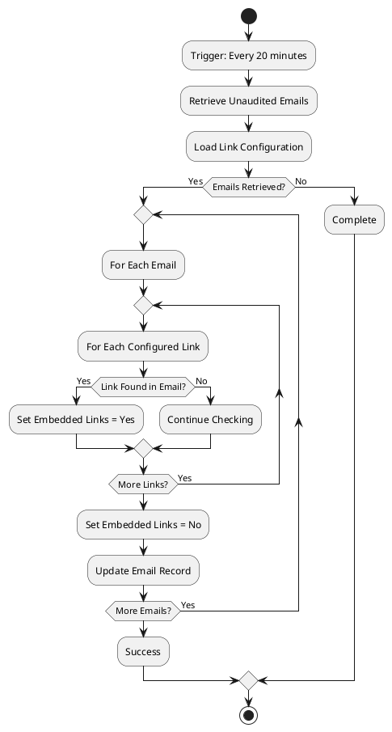
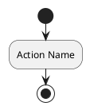
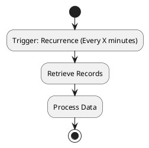
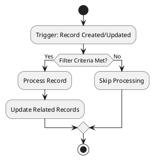
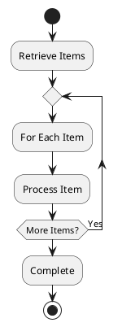
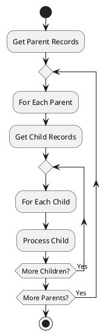

# README.md Prompt Template

When generating a README.md file for a Power Automate cloud flow, analyze the flow JSON and create a comprehensive, business-focused description following this structure:

## Document Structure

### 1. Flow Overview

**Include:**

- **Flow Name:** The display name from the JSON or filename
- **Purpose:** A clear 1-2 sentence description of what the flow does and why it exists
- **Business Context:** How this flow supports business processes or user needs
- **Type:** Automated, Instant (manual trigger), or Scheduled
- **Make Link:** A direct link to open the flow in the Power Automate Make interface

**Make Link Construction:**

The Make link is built from three parts — all sourced from known config and the flow filename:

1. **Flow GUID** — extracted from the source filename (e.g. `AutomatedEmailAudit-40A14697-75B0-ED11-83FE-0022483BB7EC.json` → GUID = `40a14697-75b0-ed11-83fe-0022483bb7ec`). Always lowercase.
2. **Environment ID** — from `.env` → `MAKE_ENVIRONMENT_ID`
3. **Solution ID** — from `.env` → `MAKE_SOLUTION_ID`

URL format:
```
https://make.powerapps.com/environments/{make_environment_id}/solutions/{make_solution_id}/objects/cloudflows/{flow-guid}/view
```

**Example:**

```markdown
# AutomatedEmailAudit

## Overview

**Purpose:** Automatically audits email records in Dynamics 365 to detect embedded links and flag potential security risks.

**Business Context:** Supports information security compliance by identifying emails with embedded hyperlinks that may pose phishing or security threats. Helps case managers and administrators maintain a secure communication environment.

**Type:** Scheduled (Recurrence)

**Make Link:** [Open in Power Automate](https://make.powerapps.com/environments/92e565fb-bae2-ed44-ac29-db4b0e9437f5/solutions/fd140aaf-4df4-11dd-bd17-0019b9312238/objects/cloudflows/40a14697-75b0-ed11-83fe-0022483bb7ec/view)
```

### 2. Trigger

**Include:**

- **Trigger Type:** What initiates the flow (Recurrence, Dataverse trigger, HTTP request, manual, etc.)
- **Trigger Conditions:** When/how the flow is triggered
- **Frequency/Schedule:** For scheduled flows, specify recurrence details
- **Filter Criteria:** For Dataverse triggers, include filter conditions

**Example:**

```markdown
## Trigger

**Type:** Recurrence

**Schedule:** Runs every 20 minutes

**Description:** The flow automatically triggers on a 20-minute interval to continuously monitor email records for embedded links.
```

### 3. High-Level Logic

**Include:**

- **Main Steps:** Describe the flow logic at a conceptual level (not action-by-action)
- **Decision Points:** Key conditions or branches in the logic
- **Loops/Iterations:** When the flow processes multiple records
- **Key Operations:** Major actions like creating records, sending emails, calling APIs

**Guidelines:**

- Use numbered or bulleted lists for clarity
- Focus on WHAT the flow does, not HOW it does it technically
- Explain business logic, not technical implementation
- Group related actions into logical steps

**Example:**

```markdown
## High-Level Logic

1. **Retrieve Emails:** Query Dataverse for email records that haven't been audited yet
2. **Load Configuration:** Fetch the list of links to check for from configuration records
3. **Audit Each Email:**
   - For each email retrieved, check if the email body contains any of the configured links
   - If a link is found, mark the email with "Embedded Links Found" flag
   - If no links are found, mark the email as "No Embedded Links"
4. **Error Handling:** Capture and log any errors during processing to prevent flow failure

**Decision Logic:**

- If email contains configured link → Flag as "Embedded Links Found"
- If email does not contain configured links → Flag as "No Embedded Links"
```

### 4. Flow Diagram

**Include:**

- **Visual Representation:** A PlantUML activity diagram that visualizes the flow's logic
- **Key Elements:** Trigger, major actions, decision points, loops, error handling, and completion

**Workflow for Diagram Generation:**

1. **Create PlantUML File:** Generate a `logic-diagram.puml` file in the same folder as README.md
2. **Generate PNG Image:** Use the PlantUML tool to generate `logic-diagram.png` from the .puml file
   ```bash
   plantuml -tpng wiki/Technical-Reference/cloud-flows/<FlowName>/logic-diagram.puml
   ```
3. **Embed in README.md:** Reference the PNG image using markdown:
   ```markdown
   
   ```

**PlantUML Activity Diagram Guidelines:**

- Use PlantUML activity diagram syntax (not Mermaid)
- Start with `@startuml` and end with `@enduml`
- Use `:Activity;` for action/process steps
- Use `if (condition?) then (yes) else (no) endif` for decisions
- Use `repeat :action; repeat while (condition?) is (yes)` for loops
- Use `start` and `stop` for flow start/end points
- Keep diagram high-level (don't include every single action)
- Focus on business logic flow, not technical implementation details
- Use clear, descriptive labels

**Example:**

````markdown
## Flow Diagram


**Diagram Explanation:**

- **Start/Stop**: Flow entry and exit points
- **Diamond nodes**: Decision points in the flow
- **Rectangle nodes**: Actions and processes
- **Repeat loops**: Iteration over multiple items
````

The corresponding `logic-diagram.puml` file should contain:



**PlantUML Syntax Quick Reference:**

PlantUML Activity Diagram syntax for Power Automate flows:



**Core Elements:**

- `start` / `stop` - Flow entry and exit points
- `:Action Name;` - Action or process step
- `if (condition?) then (yes) else (no) endif` - Decision/branching
- `repeat :action; repeat while (condition?) is (yes)` - Loop/iteration
- `partition "Name" { }` - Group related actions (optional)
- `note right/left: text` - Add explanatory notes (optional)

**Example Patterns:**

**Example Patterns:**

1. **Scheduled Trigger:**


2. **Dataverse Trigger:**


3. **Loop Pattern:**


4. **Nested Loop Pattern:**


5. **Branch with Multiple Conditions:**
```plantuml
@startuml
start
:Get Program Type;
if (Program Type?) then (SIS)
  :Set SIS Configuration;
else (SEI)
  :Set SEI Configuration;
else (Other)
  :Set Default Configuration;
endif
:Continue Processing;
stop
@enduml
```

**Best Practices for Flow Diagrams:**

- Keep it readable: Limit to 15-25 steps for clarity
- Use consistent naming: Match labels to flow action purposes
- Show key decision points: Use if/then/else for branching logic
- Simplify loops: Show loop structure without every iteration detail
- Use descriptive labels: Make it clear what each step does
- Focus on business logic: Abstract away technical details
- Group related logic: Use partitions for major sections (optional)

**Important:**
1. Always create the `logic-diagram.puml` file first
2. Generate the PNG using: `plantuml -tpng logic-diagram.puml`
3. Embed the PNG in README.md using: ``
4. Do not embed PlantUML code blocks directly in README.md

### 5. Inputs

**Include:**

- **Required Inputs:** Data or parameters the flow needs to run
- **Source:** Where inputs come from (Dataverse queries, configuration tables, environment variables, HTTP requests, etc.)
- **Format:** Expected data type or structure

**Example:**

```markdown
## Inputs

| Input                | Source                                       | Description                                                 |
| -------------------- | -------------------------------------------- | ----------------------------------------------------------- |
| Email Records        | Dataverse Query                              | Emails where `mnp_automatedaudit` is null (not yet audited) |
| Link Configuration   | Dataverse (`mnp_embeddedlinksconfiguration`) | List of hyperlinks to scan for in email bodies              |
| Connection Reference | Environment Variable (`mnp_DataverseMSS`)    | Dataverse connection used for queries and updates           |
```

### 6. Outputs

**Include:**

- **Primary Outputs:** What the flow produces or updates
- **Side Effects:** Records created, updated, emails sent, notifications triggered
- **Success Indicators:** How to know the flow succeeded

**Example:**

```markdown
## Outputs

| Output                  | Type             | Description                                                                                    |
| ----------------------- | ---------------- | ---------------------------------------------------------------------------------------------- |
| Updated Email Records   | Dataverse Update | Email records with `mnp_automatedaudit` = "Audited" and `mnp_embeddedlinksfound` set to Yes/No |
| Audit Completion Status | Flow Run History | Success/failure status in Power Automate run history                                           |

**Success Criteria:**

- All retrieved emails are audited and flagged appropriately
- No unhandled exceptions
- Flow completes within expected time frame
```

### 7. Dependencies

**Include:**

- **Dataverse Entities:** Tables the flow reads from or writes to
- **Connection References:** External systems or connectors used
- **Other Flows:** Child flows or flows that must run before/after this one
- **Configuration Data:** Lookup tables, environment variables, or settings
- **Custom Connectors/APIs:** External APIs or custom connectors

**Example:**

```markdown
## Dependencies

### Dataverse Entities

- `email` - Email activity table (read and update)
- `mnp_embeddedlinksconfiguration` - Configuration table storing links to scan for

### Connections

- **mnp_DataverseMSS** - Primary Dataverse connection for all operations

### Configuration

- Embedded Links Configuration records must exist in Dataverse
- Configuration table must have at least one active link definition

### Related Flows

- None (standalone flow)
```

### 8. Frequency & Performance

**Include:**

- **Run Frequency:** How often the flow runs
- **Expected Volume:** Typical number of records processed per run
- **Performance Considerations:** Timing, throttling, or scalability notes

**Example:**

```markdown
## Frequency & Performance

**Run Schedule:** Every 20 minutes (72 times per day)

**Expected Volume:**

- Typically processes 10-50 emails per run
- Peak times may process 100-200 emails

**Performance Notes:**

- Flow uses "Apply to each" loops which may slow down with high email volumes
- Consider batching or pagination for improved performance if email volume increases significantly
```

### 9. Business Value

**Include:**

- **Benefits:** What business value this flow provides
- **Problems Solved:** Issues this flow addresses
- **Users Impacted:** Who benefits from this automation

**Example:**

```markdown
## Business Value

**Benefits:**

- Automated security monitoring reduces manual review time
- Early detection of potential phishing attempts
- Consistent application of security policies across all emails

**Problems Solved:**

- Manual email auditing was time-consuming and error-prone
- Security threats could go unnoticed without systematic scanning
- Inconsistent application of security checks across the organization

**Users Impacted:**

- Case managers receive safer, pre-screened communications
- IT security team has visibility into embedded link patterns
- Administrators can monitor security compliance
```

## Tone & Style Guidelines

- **Audience:** Business users, process owners, and analysts (not just developers)
- **Clarity:** Use plain language; avoid excessive technical jargon
- **Conciseness:** Be thorough but concise; aim for 1-2 pages
- **Context:** Always explain WHY, not just WHAT
- **Structure:** Use headings, tables, and lists for readability

## What NOT to Include

- ❌ Line-by-line action breakdowns (save for CodeReview.md)
- ❌ Technical implementation details (JSON structure, API endpoints)
- ❌ Code snippets or expressions (unless necessary for understanding)
- ❌ Debugging or troubleshooting steps
- ❌ Recommendations or improvements (save for CodeReview.md)

## Handling Missing Information

If certain information is not available in the flow JSON:

- **Infer from context:** Use flow name, actions, and logic to deduce purpose
- **Mark as unclear:** Use "Purpose unclear - needs clarification" if truly ambiguous
- **Make reasonable assumptions:** State assumptions clearly (e.g., "Appears to be triggered by...")
- **Focus on observable:** Describe what the flow demonstrably does

## Example Complete README.md

See the structure above for individual sections. A complete README.md should flow naturally from Overview → Trigger → Logic → Flow Diagram → Inputs → Outputs → Dependencies → Performance → Business Value.

**Length:** Typically 250-500 lines including formatting, tables, and PlantUML diagram.

---

**Remember:** README.md is for understanding WHAT the flow does and WHY it exists. CodeReview.md is for understanding HOW it works and how to improve it.
