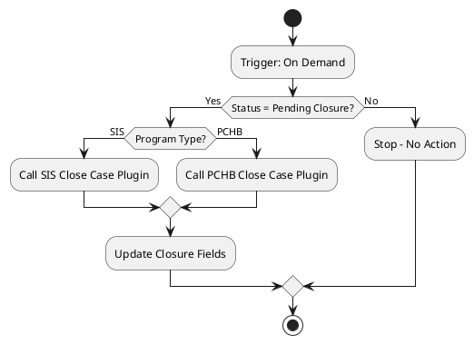

# README.md Prompt Template

When generating a README.md for a classic XAML workflow, analyze both the `.xaml` and `.xaml.data.xml` files to produce a business-focused description.

**Load before parsing:** `.github/skills/dataverse-solution-parser/references/workflow-schema.md` — use it to interpret every XAML element encountered (activities, control flow, expressions, variable types).

**Load for project context:** `.github/skills/dv-doc-xaml-workflows/references/xaml-project-patterns.md` — entity display names, MNP plugin names, option set value mappings, and DisplayName conventions.

## Document Structure

### 1. Workflow Overview

**Include:**
- **Workflow Name:** From the `Name` attribute in `.data.xml`
- **Purpose:** 1-2 sentence description of what the workflow does and why
- **Business Context:** How this supports business processes
- **Type:** Background / Real-time, On-demand / Automated
- **Primary Entity:** What table/entity this workflow operates on
- **Edit Link:** A direct link to open the workflow in the Dynamics 365 workflow editor

**Edit Link Construction:**

The edit link is built from three parts — all sourced from known config and the `.data.xml` file:

1. **Workflow GUID** — from the `WorkflowId` attribute in the `.data.xml` file (e.g. `{2d17ba2a-0e2a-4219-9702-4d05da60a270}`). Also the GUID suffix in the filename, lowercased.
2. **Environment URL** — from `.env` → `DATAVERSE_URL`
3. **Solution ID** — from `.env` → `MAKE_SOLUTION_ID`

URL format:
```
{environment_url}sfa/workflow/edit.aspx?_CreateFromId=%7b{solution_id}%7d&_CreateFromType=7100&appSolutionId=%7b{solution_id}%7d&id=%7b{workflow_guid}%7d
```

**Example:**

```markdown
# SIS - Close Case

## Overview

**Purpose:** Automatically completes the case closure process when a case is manually triggered for closure, ensuring all required fields and statuses are properly set.

**Business Context:** Supports the SIS program case management lifecycle by enforcing consistent case closure procedures and data integrity.

**Type:** Background (Asynchronous) | On-Demand
**Primary Entity:** Case (Incident)
**Edit Link:** [Open in Dynamics 365](https://ssiaprojectdev2.crm3.dynamics.com/sfa/workflow/edit.aspx?_CreateFromId=%7bfd140aaf-4df4-11dd-bd17-0019b9312238%7d&_CreateFromType=7100&appSolutionId=%7bfd140aaf-4df4-11dd-bd17-0019b9312238%7d&id=%7be9581e0b-f5c7-49cd-81b7-7eaf5d668b3a%7d)
```

### 2. Trigger

**Include:**
- **Trigger Type:** When the workflow fires (on create, on field update, on demand, etc.)
- **Trigger Fields:** If triggered by field updates, list which fields
- **Scope:** Organization / Business Unit / User
- **Run As:** Owner or Calling User

**Example:**
```markdown
## Trigger

**Type:** Field Updated
**Fields:** statuscode, statecode
**Scope:** Organization
**Run As:** Owner

**Description:** Fires when the invoice status or state is changed.
```

### 3. High-Level Logic

**Include:**
- **Main Steps:** Conceptual description (not line-by-line)
- **Decision Points:** Key conditions checked
- **Key Operations:** Record updates, creates, emails sent, plugin calls
- **Custom Activities:** If the workflow calls custom plugins, name them

**Guidelines:**
- Focus on WHAT, not HOW
- Group related steps into logical phases
- Explain business rules, not XAML syntax
- Translate option set values to meaningful names when known

**Example:**
```markdown
## High-Level Logic

1. **Check Eligibility:** Verify the case status is "Pending Closure" and program type matches
2. **Program-Specific Closure:**
   - SIS cases: Call the SIS Close Case custom activity
   - PCHB cases: Call the PCHB Close Case custom activity  
3. **Post-Closure Updates:** Set closure date, update status reason, clear draft flags
4. **Stop:** Workflow terminates after completion

**Decision Logic:**
- If status reason = "Pending Closure" AND program type = SIS → Execute SIS closure
- If status reason = "Pending Closure" AND program type = PCHB → Execute PCHB closure
- If neither condition met → Stop without action
```

### 4. Workflow Diagram

Generate a PlantUML activity diagram:

1. Create `logic-diagram.puml` in the same documentation folder
2. Generate PNG: `plantuml -tpng logic-diagram.puml`
3. Embed in README: ``

**PlantUML Guidelines for XAML Workflows:**
- Use activity diagram syntax (`@startuml` / `@enduml`)
- Map ConditionStep DisplayNames to readable diamond nodes
- Map Step DisplayNames to activity rectangles
- Show custom plugin activity calls as distinct steps
- Keep high-level: group boilerplate XAML into logical steps

**Example:**


### 5. Inputs

**Include:**
- Primary entity record (always present as `InputEntities["primaryEntity"]`)
- Fields read by `GetEntityProperty` steps
- Any referenced related entities

**Example:**
```markdown
## Inputs

| Input | Source | Description |
|-------|--------|-------------|
| Case Record | InputEntities["primaryEntity"] | The case being closed |
| Status Reason | `statuscode` field | Current status to check eligibility |
| Program Type | `mnp_programtype` field | Determines closure path (SIS/PCHB) |
```

### 6. Outputs / Side Effects

**Include:**
- Records updated (fields set by workflow)
- Records created
- Emails sent
- Status/state changes

**Example:**
```markdown
## Outputs

| Output | Type | Description |
|--------|------|-------------|
| Case Record | Update | Status set to Closed, closure date populated |
| Invoice Records | Update | Active invoices deactivated on closure |
```

### 7. Dependencies

**Include:**
- Entities read or updated
- Custom plugin assemblies called
- Child workflows triggered
- Related workflows that must run before/after

**Example:**
```markdown
## Dependencies

### Entities
- `incident` - Primary case record (read and update)
- `invoice` - Related invoices (deactivated on closure)

### Custom Activities
- `SIS Close Case` - Custom plugin assembly handling SIS-specific closure logic

### Related Workflows
- Triggered after case status changes to "Pending Closure"
```

### 8. Business Value

**Include:**
- What problem this workflow solves
- Who benefits
- Risks if the workflow fails or is deactivated

**Example:**
```markdown
## Business Value

**Purpose:** Ensures consistent, error-free case closure across all SIS cases.

**Benefits:**
- Prevents incomplete closures (missing fields, active invoices)
- Enforces program-specific business rules automatically
- Reduces manual data entry errors

**If Deactivated:** Cases could be closed without proper cleanup, leading to orphaned invoices and incomplete audit trails.
```

## Tone & Style

- Audience: Business analysts, developers, and case managers
- Avoid raw XAML attribute names where possible; translate to meaningful names
- ConditionStep DisplayNames are good clues — use them in your descriptions
- Mark any assumptions clearly

## What NOT to Include

- Raw XAML snippets
- Variable names like `ConditionBranchStep2_3`
- EvaluateExpression / EvaluateCondition boilerplate details
- Line-by-line XAML breakdown (save for CodeReview.md)
