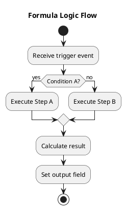

# README.md — AI Generation Prompt & Rules

**Purpose**: Generate `README.md` for a North52 formula — a business-focused explanation of what the formula does and how it works.

**Audience**: Business analysts, functional consultants, and product owners.


## AI Context

> This prompt references `references/best-practices.md` for formula type-specific standards and execution context (synchronous vs. asynchronous, client-side vs. server-side) that inform how the formula's behaviour and impact are described.

**AI Persona**: You are a technical writer and business analyst translating North52 formula logic into clear, jargon-free documentation for non-developer stakeholders.

**Writing Approach**: Explain *what* the formula accomplishes, *why* it exists, and *how* the logic flows — in plain language accessible to both business stakeholders and developers. Reserve deep technical analysis (performance, anti-patterns, code structure) for `CodeReview.md`. Use formula type context from `references/best-practices.md` (Section 8 — Formula Type-Specific Standards) to accurately characterise what each formula type is responsible for.

---

**Input files to read before generating** (from `.staging/north52/<entity>/<shortcode>/` after fetch, or `wiki/Technical-Reference/North52/<entity>/<shortcode>/` if already merged):

- `*.n52` — the raw formula code
- `*.fetch.xml` — FetchXML queries used in the formula (if present)
- `analysis_metadata.json` — structured metadata (entity, type, event, variables, functions, decision tables, complexity indicators)

---

## Required Sections

### 1. Formula Overview

- Formula name and shortcode
- Purpose in plain language (what does this formula accomplish?)
- Trigger event (Create, Update, Delete, etc.)
- Execution context (Client Side, Server Side, Scheduled)
- Record link to open the formula directly in Dynamics 365

**Record Link Construction:**

The record link is built from two parts — sourced from `analysis_metadata.json` and `.env`:

1. **Formula GUID** — from `analysis_metadata.json` → `formula.formula_id` (e.g. `a5cb1694-7d7b-4d53-922a-bdf332302121`)
2. **App ID** — from `.env` → `NORTH52_APP_ID`
3. **Environment URL** — from `.env` → `DATAVERSE_URL`

URL format:
```
{environment_url}main.aspx?appid={north52_app_id}&pagetype=entityrecord&etn=north52_formula&id={formula_id}
```

**Example:**

```markdown
## Overview

**Formula Name:** Service Provider - Payee Status Validation (`cTk`)
**Purpose:** Validates the payee status on an Account record by checking team membership across all four programs.
**Trigger:** Save (Update)
**Execution Context:** Server Side
**Record Link:** [Open in Dynamics 365](https://ssiaprojectdev2.crm3.dynamics.com/main.aspx?appid=44268082-84bd-eb11-bacc-0022483bbcd2&pagetype=entityrecord&etn=north52_formula&id=a5cb1694-7d7b-4d53-922a-bdf332302121)
```

> **Note:** If `formula.formula_id` is `null` in `analysis_metadata.json`, the formula was analyzed from a local file rather than fetched from Dataverse. Re-fetch with `fetch_north52_from_dataverse.py --shortcode <code> --analyze` to populate the GUID.

### 2. Dataverse Dependencies

- **Primary Entity**: The source entity the formula runs on
- **Related Entities**: Entities accessed via lookups or queries
- **Key Attributes**: Fields that are read or written
- **Lookup Relationships**: Navigation paths used

### 3. Logic Flow

- Step-by-step explanation of the formula's calculations in plain language
- Decision points and branching logic
- Variable usage and what each variable represents
- How data flows through the formula

### 4. Business Rules & Calculations

- What values get calculated and why
- Thresholds, rates, or business rules applied
- Examples with sample input/output data where helpful
- Edge cases and how they are handled

### 5. Impact & Side Effects

- What fields get updated as a result
- Other formulas or workflows that may be triggered
- User experience impact (e.g., form field refresh, save behaviour)

---

## Style Guidelines

- **Audience**: Write for business analysts and functional consultants — not developers
- **Language**: Use plain language; avoid or explain technical jargon
- **Logic explanation**: Describe *what* the formula does, not *how* the code works
- **Examples**: Include concrete scenarios and sample data where it aids understanding
- **Completeness**: Document assumptions and what happens in edge/boundary cases
- **Visuals**: Add a PlantUML activity diagram if logic is complex or multi-step (see Section 6 — the diagram file is generated separately and embedded as an image)
- **Format**: Use markdown headings, bullet lists, tables, and diagrams where appropriate

---

## 6. Visual Logic Flow (Optional)

If the formula logic is complex or involves multiple steps/branches, generate a PlantUML activity diagram and embed the rendered PNG in the README.

### Steps

1. **Create** `wiki/Technical-Reference/North52/<entity>/<shortcode>/diagram.puml` using PlantUML activity diagram syntax.
2. **Generate the PNG** by running:
   ```bash
   cd .github/skills/n52-doc/scripts
   python generate_diagram.py <entity> <shortcode>
   ```
   This calls `java -jar plantuml.jar` locally and saves `diagram.png` alongside the `.puml` file.
3. **Embed the image** in README.md:
   ```markdown
   ## Logic Flow Diagram

   
   ```

### PlantUML Activity Diagram Example



- Use `start` / `stop` for entry and exit points
- Use `:Activity;` for action steps (plain language labels)
- Use `if (condition?) then (yes) ... else (no) ... endif` for decisions
- Use `fork` / `end fork` for parallel branches
- Keep labels high-level — avoid North52 function names
- Use `title` to describe the diagram purpose
- Use `partition "Name" { }` to group related steps into swimlanes when helpful

---

## 7. Decision Table Sheets (When Present)

Some formulas are Decision Tables. When `dt_*.md` files exist alongside the README.md, include a **Decision Table Sheets** section that links to each file.

**Detection**: Check whether any `dt_*.md` files exist in the formula folder. If they do, also check for `dt_index.md`.

**How to generate the decision table files** (if not yet present):

```bash
python extract_decision_tables.py <entity> <shortcode>
```

This creates one `dt_<SheetName>.md` per visible sheet and a `dt_index.md` index file.

**Required README section** (add after Section 5 — Impact & Side Effects):

```markdown
## Decision Table Sheets

This formula is implemented as a North52 Decision Table. The following sheets define
the business rules. Each sheet is documented in a separate file for readability:

| Sheet | Description |
|-------|-------------|
| [SheetName](dt_SheetName.md) | Brief description of what this sheet evaluates |

> See [dt_index.md](dt_index.md) for a full listing of all sheets.
```

**Guidelines**:
- Link each sheet file using its sanitized filename (`dt_<SanitizedName>.md`)
- Provide a one-sentence description of each sheet's purpose (infer from the sheet name and column labels)
- If `dt_index.md` exists, always link to it
- If no `dt_*.md` files exist yet, mention that decision table documentation can be generated with `extract_decision_tables.py`

---

## Output

Save the generated content to:

```
wiki/Technical-Reference/North52/<entity>/<shortcode>.md
```

After generating, update the metadata timestamp:

```bash
python update_ai_timestamps.py <entity> <shortcode>
```
