# PlantUML Expert

Expert guidance for PlantUML, a powerful open-source tool for creating UML and other diagrams using simple text-based syntax. PlantUML transforms text descriptions into professional diagrams for software documentation, architecture visualization, and technical communication.

## Official Resources

- **GitHub Repository**: https://github.com/plantuml/plantuml
- **Official Documentation**: https://plantuml.com/

## Core Concepts

**PlantUML is a text-to-diagram tool that supports:**

- **UML Diagrams**: Sequence, use case, class, activity, component, state, object, deployment, timing
- **Project Management**: Gantt charts, WBS (Work Breakdown Structure), mindmaps
- **Network Diagrams**: nwdiag (network diagrams)
- **Data Visualization**: JSON, YAML visualization
- **Architecture**: ArchiMate diagrams, component diagrams
- **UI Mockups**: Salt (wireframes)
- **Formal Notation**: EBNF (Extended Backus-Naur Form), regex diagrams
- **Timeline**: Chronology diagrams

### Basic Syntax Structure

All PlantUML diagrams start with `@startuml` and end with `@enduml`:

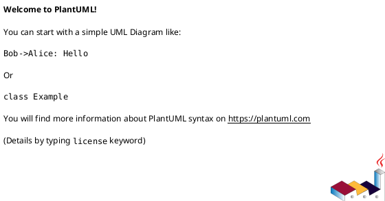

**Comments:**

- Single line: `' This is a comment`
- Multi-line: `/' Multi-line comment '/`

### Installation and Setup

**Java Required**: PlantUML requires Java Runtime Environment (JRE) 8 or higher.

**Installation Methods:**

1. **JAR File** (Recommended):

   On Windows the skill prefers a per-user install location. The following locations are checked (in order):
   - `%LOCALAPPDATA%\plantuml\plantuml.jar` (recommended)
   - `.github/tools/plantuml.jar` (project-level)
   - `%USERPROFILE%\plantuml.jar`

   To download and install to the recommended Windows location, run the included installer:

   ```powershell
   powershell -NoProfile -ExecutionPolicy Bypass -File .github\tools\install-plantuml.ps1
   ```

   Or download manually and run:

   ```bash
   # Download latest plantuml.jar from https://plantuml.com/download
   java -jar plantuml.jar diagram.puml
   ```

2. **VS Code Extension**:
   - Install "PlantUML" extension by jebbs
   - Preview diagrams with `Alt+D` (Windows/Linux) or `Option+D` (Mac)
   - Export diagrams with various formats

3. **Command Line Tools**:

   ```bash
   # Using npm
   npm install -g node-plantuml

   # Using Homebrew (Mac)
   brew install plantuml
   ```

### Generating Diagrams

**Command Line:**

```bash
# Generate PNG (default)
java -jar plantuml.jar diagram.puml

# Generate SVG
java -jar plantuml.jar -tsvg diagram.puml

# Generate ASCII art
java -jar plantuml.jar -ttxt diagram.puml

# Generate PDF
java -jar plantuml.jar -tpdf diagram.puml

# Process multiple files
java -jar plantuml.jar "src/**/*.puml"

# Watch mode (regenerate on change)
java -jar plantuml.jar -gui
```

**Output Formats:**

- PNG (default)
- SVG (recommended for web)
- PDF
- LaTeX
- ASCII art text
- EPS

## Diagram Types and Syntax

### 1. Sequence Diagram

**Use for**: Modeling interactions between objects over time, API flows, message exchanges.

**Basic Syntax:**

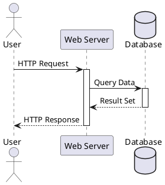

**Key Features:**

- Participants: `participant`, `actor`, `boundary`, `control`, `entity`, `database`, `collections`
- Messages: `->` (sync), `-->` (async), `->>` (lost), `<<--` (return)
- Activation: `activate` / `deactivate`
- Notes: `note left of`, `note right of`, `note over`
- Grouping: `alt/else`, `opt`, `loop`, `par`, `break`, `critical`, `group`
- Dividers: `== Title ==`
- Delays: `...5 minutes later...`
- Autonumbering: `autonumber`

**Example with Advanced Features:**

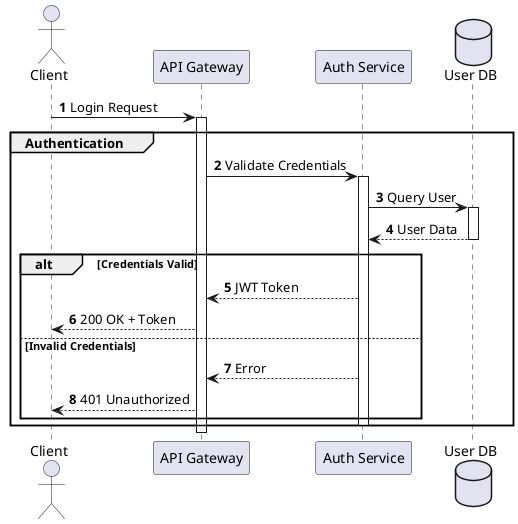

**Documentation**: https://plantuml.com/sequence-diagram

### 2. Use Case Diagram

**Use for**: Showing system functionality from user perspective, requirements gathering.

**Basic Syntax:**

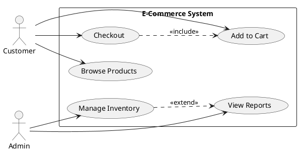

**Key Features:**

- Actors: `actor`
- Use cases: `usecase` or `(name)`
- Relationships: `-->` (association), `..>` (include/extend)
- Stereotypes: `<<include>>`, `<<extend>>`
- System boundaries: `rectangle`, `package`
- Directions: `left to right direction`, `top to bottom direction`

**Documentation**: https://plantuml.com/use-case-diagram

### 3. Class Diagram

**Use for**: Object-oriented design, database schema, entity relationships.

**Basic Syntax:**

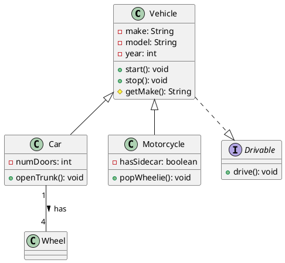

**Key Features:**

- Visibility: `+` (public), `-` (private), `#` (protected), `~` (package)
- Members: Fields and methods
- Relationships:
  - Inheritance: `<|--` or `extends`
  - Implementation: `<|..` or `..|>`
  - Composition: `*--`
  - Aggregation: `o--`
  - Association: `--`
  - Dependency: `<..`
- Cardinality: `"1"`, `"0..*"`, `"1..*"`
- Abstract: `abstract class`, `{abstract}` method
- Static: `{static}`
- Stereotypes: `<<interface>>`, `<<abstract>>`, `<<entity>>`

**Advanced Example:**

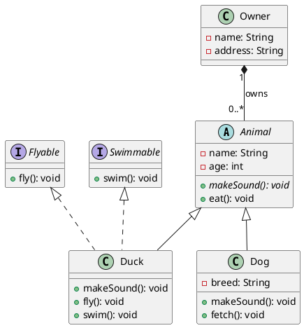

**Documentation**: https://plantuml.com/class-diagram

### 4. Activity Diagram (Beta)

**Use for**: Business processes, workflows, algorithms, decision flows.

**Basic Syntax:**

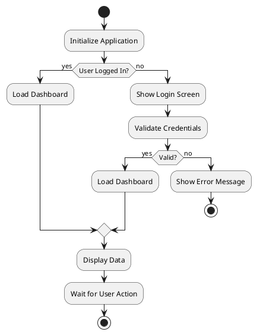

**Key Features:**

- Start/Stop: `start`, `stop`, `end`
- Activity: `:Activity Name;`
- Decision: `if (condition) then (yes) else (no) endif`
- Switch: `switch (value) case (x) case (y) endswitch`
- While loop: `while (condition) is (yes) endwhile (no)`
- Repeat: `repeat` / `repeat while` / `backward`
- Fork/Join: `fork` / `fork again` / `end fork`
- Partition: `partition "Name" { }`
- Notes: `note left`, `note right`
- Colors: `:Activity; -> color red/blue/green`

**Advanced Example:**

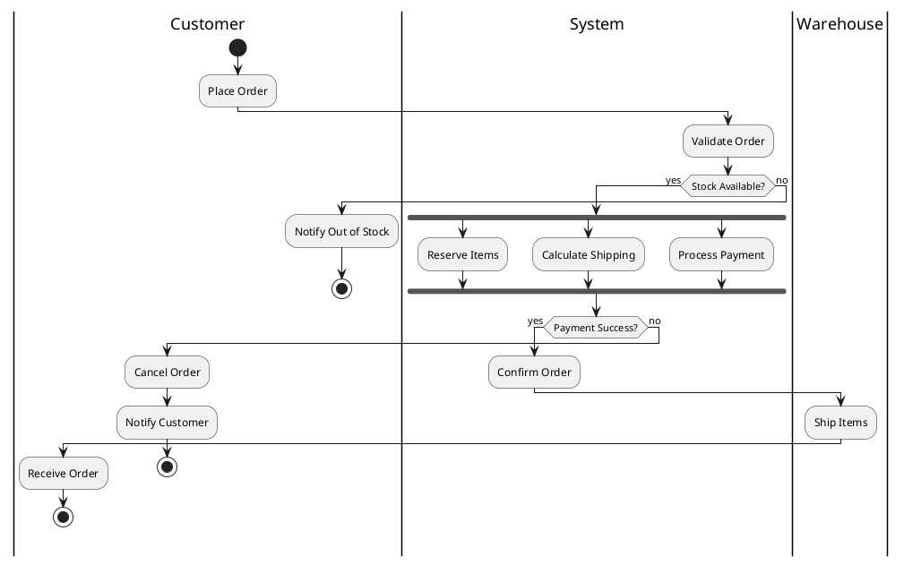

**Documentation**: https://plantuml.com/activity-diagram-beta

### 5. Component Diagram

**Use for**: System architecture, microservices, module dependencies.

**Basic Syntax:**

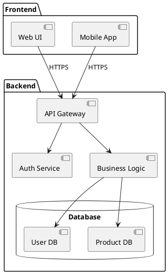

**Key Features:**

- Components: `[Component Name]`
- Packages: `package "Name" { }`
- Interfaces: `() "Interface Name" as I`
- Dependencies: `-->`, `.>` (dependency), `..>` (weak)
- Provided interface: `--( `
- Required interface: `--()`
- Database: `database`, `folder`, `frame`, `cloud`, `node`

**Documentation**: https://plantuml.com/component-diagram

### 6. State Diagram

**Use for**: State machines, object lifecycle, workflow states.

**Basic Syntax:**

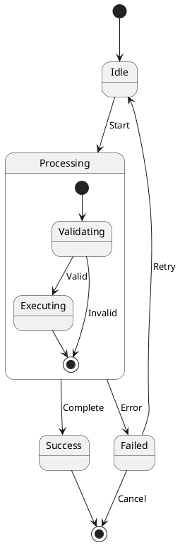

**Key Features:**

- States: `state "Name"` or simple names
- Transitions: `-->`
- Start/End: `[*]`
- Composite states: `state X { }`
- Concurrent states: `--` separator
- Notes: `note left of`, `note right of`
- Entry/Exit actions: `state X : entry / action`, `state X : exit / action`

**Documentation**: https://plantuml.com/state-diagram

### 7. Object Diagram

**Use for**: Instance-level snapshots, runtime configurations, example data.

**Basic Syntax:**

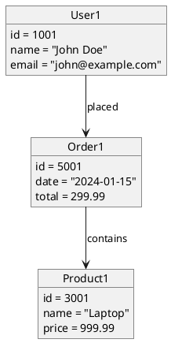

**Documentation**: https://plantuml.com/object-diagram

### 8. Entity-Relationship Diagram (ERD)

**Use for**: Database design, data modeling, table relationships.

**Basic Syntax:**

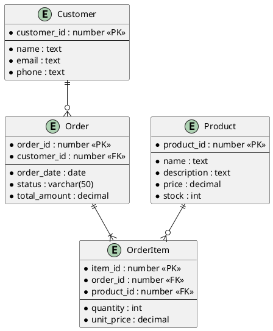

**Key Features:**

- Entity definition: `entity "Name" { }`
- Primary Key: `* field : type <<PK>>`
- Foreign Key: `* field : type <<FK>>`
- Separator: `--` (divides keys from attributes)
- Relationships:
  - Zero or one: `|o--`
  - Exactly one: `||--`
  - Zero or many: `}o--`
  - One or many: `}|--`
- Cardinality notation: `||--o{` (one to many), `}o--o{` (many to many)

**Advanced Example with IE Notation:**

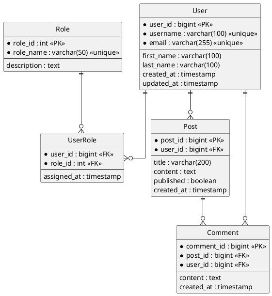

**Crow's Foot Notation:**

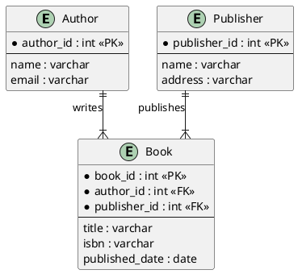

**Documentation**: https://plantuml.com/ie-diagram

### 9. Package Diagram

**Use for**: Java/module organization, namespace structure, code organization.

**Basic Syntax:**

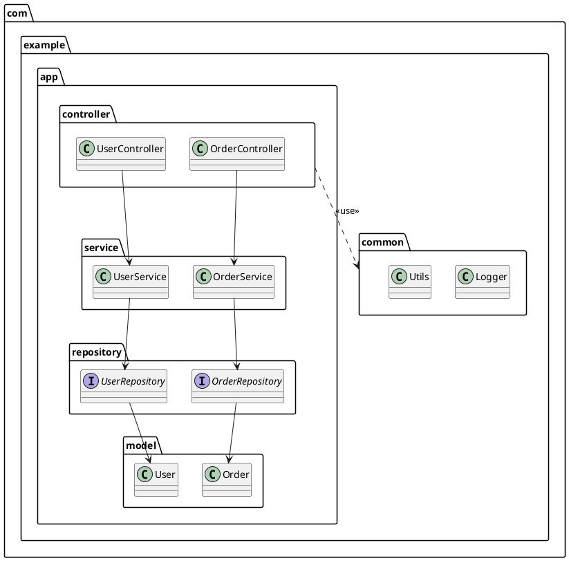

**Key Features:**

- Package: `package "name" { }`
- Nested packages: Multi-level hierarchy
- Package dependencies: `--`, `..>`
- Stereotypes: `<<import>>`, `<<access>>`
- Colors: `package "name" #LightBlue { }`

**Advanced Example:**

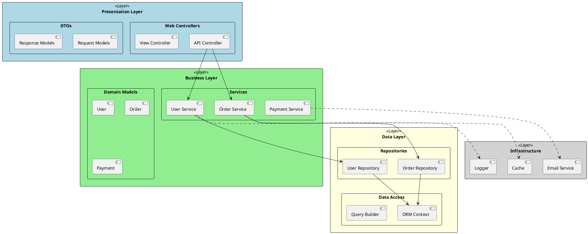

**Documentation**: https://plantuml.com/package-diagram

### 10. Deployment Diagram

**Use for**: Physical architecture, server topology, infrastructure layout.

**Basic Syntax:**

```plantuml
@startuml
node "Web Server" {
    component [Nginx]
    component [Node.js App]
}

node "App Server" {
    component [Spring Boot]
    component [Redis Cache]
}

database "PostgreSQL" {
    storage [User Data]
    storage [Transaction Data]
}

cloud "AWS" {
    node "Web Server"
    node "App Server"
    database "PostgreSQL"
}

[Nginx] --> [Node.js App]
[Node.js App] --> [Spring Boot] : REST API
[Spring Boot] --> [Redis Cache]
[Spring Boot] --> [PostgreSQL]
@enduml
```

**Key Features:**

- Nodes: `node "Name" { }`
- Artifacts: `artifact`, `component`
- Associations: `-->`
- Stereotypes: `<<device>>`, `<<execution environment>>`

**Documentation**: https://plantuml.com/deployment-diagram

### 11. Timing Diagram

**Use for**: Hardware timing, protocol analysis, concurrent timing events.

**Basic Syntax:**

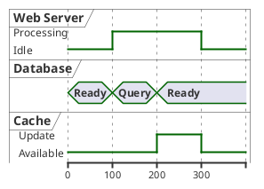

**Documentation**: https://plantuml.com/timing-diagram

### 12. Network Diagram (nwdiag)

**Use for**: Network topology, infrastructure layout, IP addressing.

**Basic Syntax:**

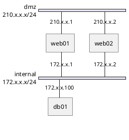

**Documentation**: https://plantuml.com/nwdiag

### 13. Wireframes (Salt)

**Use for**: UI mockups, form layouts, dialog designs.

**Basic Syntax:**

```plantuml
@startuml
salt
{
    Login Form
    {
        Username | "     "
        Password | "****  "
        [Cancel] | [  OK  ]
    }
}
@endsalt
@enduml
```

**Key Features:**

- Text field: `"text"`
- Button: `[Button]`
- Checkbox: `[X]` or `[ ]`
- Radio: `(X)` or `( )`
- Dropdown: `^Dropdown^`
- Table: `{` rows `|` columns `}`

**Documentation**: https://plantuml.com/salt

### 14. ArchiMate Diagram

**Use for**: Enterprise architecture, business architecture modeling.

**Basic Syntax:**

```plantuml
@startuml
archimate #Technology "Web Browser" as browser
archimate #Technology "Application Server" as appserver
archimate #Application "Business Logic" as logic
archimate #DataObject "Customer Data" as data

browser -down-> appserver : HTTPS
appserver -down-> logic
logic -down-> data
@enduml
```

**Documentation**: https://plantuml.com/archimate-diagram

### 15. Gantt Diagram

**Use for**: Project planning, task scheduling, timeline visualization.

**Basic Syntax:**

```plantuml
@startgantt
project starts 2024-01-01
saturday are closed
sunday are closed

[Requirement Analysis] lasts 10 days
[Design] lasts 15 days
[Implementation] lasts 30 days
[Testing] lasts 10 days
[Deployment] lasts 5 days

[Design] starts at [Requirement Analysis]'s end
[Implementation] starts at [Design]'s end
[Testing] starts at [Implementation]'s end
[Deployment] starts at [Testing]'s end

[Implementation] is colored in Coral
[Testing] is colored in LightBlue
@endgantt
```

**Key Features:**

- Task definition: `[Task Name] lasts X days`
- Dependencies: `starts at [Task]'s end`
- Milestones: `happens at [Task]'s end`
- Colors: `is colored in Color`
- Resources: `on {Resource} lasts X days`
- Progress: `is 30% complete`

**Documentation**: https://plantuml.com/gantt-diagram

### 16. Chronology Diagram

**Use for**: Timeline events, historical progression.

**Basic Syntax:**

```plantuml
@startuml
robust "Product Evolution" as PE
concise "Market Status" as MS

@2020
PE is "v1.0"
MS is "Launch"

@2021
PE is "v2.0"
MS is "Growth"

@2022
PE is "v3.0"
MS is "Mature"

@2024
PE is "v4.0"
MS is "Expanding"
@enduml
```

**Documentation**: https://plantuml.com/chronology-diagram

### 17. Mind Map

**Use for**: Brainstorming, concept organization, hierarchical ideas.

**Basic Syntax:**

```plantuml
@startmindmap
* Project Planning
** Requirements
*** Functional
*** Non-Functional
** Design
*** Architecture
*** Database Schema
** Implementation
*** Backend
*** Frontend
*** Testing
** Deployment
*** CI/CD
*** Monitoring
@endmindmap
```

**Key Features:**

- Root: `*`
- Right side: `**`, `***`, etc.
- Left side: `**_`, `***_`, etc.
- Remove box: `+ Item` or `- Item` instead of `**`
- Colors: `[#Orange]`

**Documentation**: https://plantuml.com/mindmap-diagram

### 18. Work Breakdown Structure (WBS)

**Use for**: Project decomposition, hierarchical task breakdown.

**Basic Syntax:**

```plantuml
@startwbs
* Project
** Phase 1: Planning
*** Requirements Gathering
*** Stakeholder Analysis
*** Risk Assessment
** Phase 2: Design
*** Architecture Design
*** Database Design
*** UI/UX Design
** Phase 3: Implementation
*** Backend Development
*** Frontend Development
*** Integration
** Phase 4: Testing
*** Unit Testing
*** Integration Testing
*** UAT
@endwbs
```

**Documentation**: https://plantuml.com/wbs-diagram

### 19. JSON Visualization

**Use for**: Visualizing JSON data structures, API responses.

**Basic Syntax:**

```plantuml
@startjson
{
    "user": {
        "id": 12345,
        "name": "John Doe",
        "email": "john@example.com",
        "roles": ["admin", "user"],
        "active": true
    },
    "metadata": {
        "created": "2024-01-01",
        "modified": "2024-01-15"
    }
}
@endjson
```

**Documentation**: https://plantuml.com/json

### 20. YAML Visualization

**Use for**: Visualizing YAML configurations, Kubernetes manifests.

**Basic Syntax:**

```plantuml
@startyaml
apiVersion: v1
kind: Service
metadata:
  name: my-service
spec:
  selector:
    app: MyApp
  ports:
    - protocol: TCP
      port: 80
      targetPort: 9376
@endyaml
```

**Documentation**: https://plantuml.com/yaml

### 21. EBNF Diagram

**Use for**: Grammar notation, syntax rules, language definitions.

**Basic Syntax:**

```plantuml
@startebnf
expression = term, { ("+"|"-"), term };
term = factor, { ("*"|"/"), factor };
factor = number | "(", expression, ")";
number = digit, { digit };
digit = "0" | "1" | "2" | "3" | "4" | "5" | "6" | "7" | "8" | "9";
@endebnf
```

**Documentation**: https://plantuml.com/ebnf

### 22. Regex Diagram

**Use for**: Regular expression visualization, pattern documentation.

**Basic Syntax:**

```plantuml
@startuml
regex email "^[a-zA-Z0-9._%+-]+@[a-zA-Z0-9.-]+\\.[a-zA-Z]{2,}$"
@enduml
```

**Documentation**: https://plantuml.com/regex

## Standard Library (stdlib)

PlantUML includes a rich standard library with pre-built sprites and icons for cloud providers, technologies, and common symbols.

### AWS Icons

```plantuml
@startuml
!include <awslib/AWSCommon>
!include <awslib/Compute/EC2>
!include <awslib/Compute/Lambda>
!include <awslib/Database/RDS>
!include <awslib/Storage/S3>
!include <awslib/NetworkingContentDelivery/CloudFront>
!include <awslib/NetworkingContentDelivery/APIGateway>

' Define colors
!define AWSColor(colorName) #FF9900

actor User

rectangle "AWS Architecture" {
    CloudFront(cdn, "CloudFront", "CDN")
    APIGateway(api, "API Gateway", "REST API")
    Lambda(lambda1, "Lambda", "Auth")
    Lambda(lambda2, "Lambda", "Business Logic")
    RDS(db, "RDS", "PostgreSQL")
    S3(storage, "S3", "File Storage")
    EC2(ec2, "EC2", "Worker")
}

User --> cdn
cdn --> api
api --> lambda1
api --> lambda2
lambda2 --> db
lambda2 --> storage
ec2 --> db
@enduml
```

**Available AWS Libraries:**

- `awslib/Compute/` - EC2, Lambda, ECS, EKS, etc.
- `awslib/Database/` - RDS, DynamoDB, ElastiCache, etc.
- `awslib/Storage/` - S3, EBS, EFS, etc.
- `awslib/NetworkingContentDelivery/` - VPC, CloudFront, Route53, etc.
- `awslib/SecurityIdentityCompliance/` - IAM, Cognito, etc.

**Documentation**: https://github.com/awslabs/aws-icons-for-plantuml

### Azure Icons

```plantuml
@startuml
!define AzurePuml https://raw.githubusercontent.com/plantuml-stdlib/Azure-PlantUML/release/2-2/dist
!include AzurePuml/AzureCommon.puml
!include AzurePuml/Compute/AzureFunction.puml
!include AzurePuml/Compute/AzureAppService.puml
!include AzurePuml/Databases/AzureCosmosDb.puml
!include AzurePuml/Storage/AzureBlobStorage.puml
!include AzurePuml/Web/AzureAPIManagement.puml

actor User

AzureAPIManagement(apim, "API Management", "Gateway")
AzureAppService(webapp, "App Service", "Web App")
AzureFunction(func, "Function App", "Serverless")
AzureCosmosDb(db, "Cosmos DB", "NoSQL")
AzureBlobStorage(blob, "Blob Storage", "Files")

User --> apim
apim --> webapp
apim --> func
webapp --> db
func --> blob
@enduml
```

**Documentation**: https://github.com/plantuml-stdlib/Azure-PlantUML

### Kubernetes Icons

```plantuml
@startuml
!include <kubernetes/k8s-sprites-unlabeled-25pct>

actor User

package "Kubernetes Cluster" {
    <$pod> as pod1
    <$pod> as pod2
    <$service> as svc
    <$deployment> as deploy
    <$ingress> as ingress
}

User --> ingress
ingress --> svc
svc --> pod1
svc --> pod2
deploy ..> pod1
deploy ..> pod2
@enduml
```

**Documentation**: https://github.com/dcasati/kubernetes-PlantUML

### Font Awesome and Material Icons

```plantuml
@startuml
!include <font-awesome-5/users>
!include <font-awesome-5/database>
!include <font-awesome-5/server>
!include <material/computer>
!include <material/phone_android>

<$users> User Management
<$database> Database
<$server> Application Server
<$computer> Desktop Client
<$phone_android> Mobile App
@enduml
```

### Office Icons

```plantuml
@startuml
!include <office/Servers/application_server>
!include <office/Servers/database_server>
!include <office/Servers/web_server>
!include <office/Devices/device_laptop>
!include <office/Services/office_365>

<$device_laptop> --> <$web_server>
<$web_server> --> <$application_server>
<$application_server> --> <$database_server>
<$office_365> ..> <$web_server>
@enduml
```

**Browsing Available Icons:**

```bash
# List all available stdlib
java -jar plantuml.jar -stdlib

# View specific library
java -jar plantuml.jar -stdlib awslib
```

## Creole Text Formatting

PlantUML supports Creole syntax for rich text formatting in notes, labels, and descriptions.

### Basic Formatting

```plantuml
@startuml
note left
  **Bold text**
  //Italic text//
  __Underlined text__
  --Strike through--
  ""Monospaced text""
  ~~Wave underline~~
end note

note right
  <b>Bold HTML style</b>
  <i>Italic HTML style</i>
  <u>Underline HTML style</u>
  <s>Strike HTML style</s>
  <color:red>Red text</color>
  <back:yellow>Yellow background</back>
  <size:18>Large text</size>
  <font:Arial>Arial font</font>
end note
@enduml
```

### Lists

```plantuml
@startuml
note as N1
  Unordered list:
  * Item 1
  * Item 2
  ** Sub-item 2.1
  ** Sub-item 2.2
  * Item 3
end note

note as N2
  Ordered list:
  # First step
  # Second step
  ## Sub-step 2.1
  ## Sub-step 2.2
  # Third step
end note
@enduml
```

### Tables

```plantuml
@startuml
note left
  |= **Feature** |= **Status** |
  | Authentication | <color:green>✓</color> |
  | Authorization | <color:green>✓</color> |
  | Logging | <color:yellow>⚠</color> |
  | Monitoring | <color:red>✗</color> |
end note
@enduml
```

### Horizontal Lines and Separators

```plantuml
@startuml
note right
  Section 1
  ----
  Section 2
  ====
  Section 3
end note
@enduml
```

### Code Blocks

```plantuml
@startuml
note left
  Example code:
  <code>
  function hello() {
    console.log("Hello World");
  }
  </code>
end note
@enduml
```

### Unicode and Special Characters

```plantuml
@startuml
note as N
  Symbols: ★ ☆ ♠ ♣ ♥ ♦
  Arrows: → ← ↑ ↓ ⇒ ⇐
  Math: ∀ ∃ ∈ ∉ ∑ ∏ √
  Status: ✓ ✗ ⚠ ⓘ
end note
@enduml
```

### Links and Colors Combined

```plantuml
@startuml
class User {
  + login()
}

note right of User
  **Important**: This class handles authentication

  <color:blue>**Features:**</color>
  * Session management
  * Password hashing
  * <color:red>**Security:** Use HTTPS only</color>

  See <u>[[https://example.com/docs documentation]]</u>
end note
@enduml
```

**Documentation**: https://plantuml.com/creole

## Hyperlinks in Diagrams

Make diagrams interactive with clickable links.

### Basic Links

```plantuml
@startuml
class User [[https://example.com/user-docs]]
class Order [[https://example.com/order-docs]]
class Product [[https://example.com/product-docs]]

User --> Order
Order --> Product

note right of User
  Click on classes to view documentation
end note
@enduml
```

### Links with Tooltips

```plantuml
@startuml
class User [[https://example.com/user-docs{User Documentation}]]
class Order [[https://example.com/order{Order Management System}]]

User --> Order
@enduml
```

### Links in Notes

```plantuml
@startuml
class Service

note right of Service
  For more information:
  * [[https://docs.example.com Official Documentation]]
  * [[https://github.com/example/repo GitHub Repository]]
  * [[https://api.example.com/swagger API Reference]]
end note
@enduml
```

### Local File Links

```plantuml
@startuml
class User [[file:///path/to/user-spec.pdf{User Specification}]]
class Order [[./docs/order-flow.md{Order Flow}]]
@enduml
```

**SVG Output Required**: Hyperlinks work best with SVG output format.

## Sprites and Custom Icons

Create custom icons and reusable graphics.

### Using Built-in Sprites

```plantuml
@startuml
sprite $AlertIcon [16x16/16] {
  0000000110000000
  0000011FF1100000
  0000111FF1110000
  0001111FF1111000
  0011111FF1111100
  0111111FF1111110
  1111111FF1111111
  1111111FF1111111
  1111111FF1111111
  1111111001111111
  0111111001111110
  0011111001111100
  0001111001111000
  0000111001110000
  0000011001100000
  0000000000000000
}

class Alert <<$AlertIcon>>
@enduml
```

### Creating Sprites from Images

```bash
# Convert image to sprite
java -jar plantuml.jar -encodesprite 16 logo.png > logo-sprite.puml
```

### Using Sprites in Diagrams

```plantuml
@startuml
!include logo-sprite.puml

node "Server 1" <<$logo>>
node "Server 2" <<$logo>>
database "Database" <<$logo>>
@enduml
```

### Custom Icon Procedures

```plantuml
@startuml
!procedure $customService($alias, $label)
  rectangle "$label" <<service>> as $alias #LightBlue
!endprocedure

$customService(auth, "Auth Service")
$customService(user, "User Service")
$customService(order, "Order Service")

auth --> user
user --> order
@enduml
```

### Colored Sprites

```plantuml
@startuml
sprite $success [16x16/16] {
  0000000000000000
  0000003333000000
  0000033883330000
  0003388888833000
  0033888888888300
  0338888888888830
  3388888338888883
  8888883003888888
  8888830000388888
  8888300000038888
  8883000000003888
  8830000000000388
  8300000000000038
  3000000000000003
  0000000000000000
}

class Success <<$success>>
@enduml
```

## Advanced Layout Control

### Hidden Links for Positioning

```plantuml
@startuml
class A
class B
class C
class D

A -[hidden]right-> B
C -[hidden]right-> D
A -down-> C
B -down-> D
@enduml
```

### Together Grouping

```plantuml
@startuml
class A
class B
class C

together {
  class D
  class E
  class F
}

A --> D
B --> E
C --> F
@enduml
```

### Direction Control

```plantuml
@startuml
' Force specific directions
A -right-> B
C -down-> D
E -left-> F
G -up-> H

' Set global direction
left to right direction

class User
class Order
class Product

User --> Order
Order --> Product
@enduml
```

### Link Length Control

```plantuml
@startuml
class A
class B
class C
class D

' Longer links
A --> B
A ---> C
A ----> D

' Different notation
A -[norank]-> B
@enduml
```

### Layout Hints

```plantuml
@startuml
skinparam ranksep 20
skinparam nodesep 10

class A
class B
class C

' Control ranking
A -[rank=1]-> B
A -[rank=2]-> C
@enduml
```

### Complex Layout Example

```plantuml
@startuml
left to right direction

package "Frontend" {
  class WebUI
  class MobileUI
}

together {
  package "API Layer" {
    class APIGateway
    class AuthService
  }
}

package "Business Logic" {
  class UserService
  class OrderService
  class ProductService
}

package "Data Layer" {
  database UserDB
  database OrderDB
  database ProductDB
}

WebUI -down-> APIGateway
MobileUI -down-> APIGateway

APIGateway -right-> AuthService
APIGateway -down-> UserService
APIGateway -down-> OrderService
APIGateway -down-> ProductService

UserService -down-> UserDB
OrderService -down-> OrderDB
ProductService -down-> ProductDB

' Hidden links for alignment
UserService -[hidden]right-> OrderService
OrderService -[hidden]right-> ProductService
UserDB -[hidden]right-> OrderDB
OrderDB -[hidden]right-> ProductDB
@enduml
```

**Documentation**: https://plantuml.com/layout

## Styling and Theming

### Colors

**Inline Colors:**

```plantuml
@startuml
class User #lightblue
class Admin #lightgreen
User <|-- Admin
@enduml
```

**Background Colors:**

```plantuml
@startuml
skinparam backgroundColor #EEEBDC
skinparam handwritten true
@enduml
```

### Themes

**Built-in Themes:**

```plantuml
@startuml
!theme cerulean
' Other themes: amiga, aws-orange, black-knight, bluegray, crt-amber, crt-green, hacker, mars, materia, mimeograph, plain, sketchy, spacelab, toy, vibrant
@enduml
```

### Skinparam

**Common Skinparam Options:**

```plantuml
@startuml
skinparam monochrome true
skinparam shadowing false
skinparam defaultFontName Arial
skinparam defaultFontSize 14
skinparam classBorderColor black
skinparam classBackgroundColor lightblue
skinparam arrowColor red
@enduml
```

## Best Practices

### 1. File Organization

```plaintext
docs/
  diagrams/
    architecture/
      system-overview.puml
      component-diagram.puml
    sequence/
      login-flow.puml
      checkout-process.puml
    class/
      domain-model.puml
```

### 2. Use Includes for Reusability

**common.puml:**

```plantuml
!define BLUE #1E90FF
!define GREEN #32CD32
!define RED #FF6347
```

**diagram.puml:**

```plantuml
@startuml
!include common.puml

class User BLUE
class Admin GREEN
@enduml
```

### 3. Add Titles and Legends

```plantuml
@startuml
title System Architecture Diagram\nVersion 2.0

legend right
  | Color | Meaning |
  | <#lightblue> | External Service |
  | <#lightgreen> | Internal Service |
  | <#lightyellow> | Database |
endlegend

@enduml
```

### 4. Use Notes for Context

```plantuml
@startuml
class User {
    - password: String
}

note right of User::password
    Passwords are hashed using
    bcrypt before storage
end note
@enduml
```

### 5. Keep Diagrams Focused

- One concept per diagram
- Limit complexity (5-10 main elements)
- Use packages/partitions for grouping
- Split large diagrams into multiple files

### 6. Version Control Integration

```bash
# Generate diagrams in CI/CD pipeline
java -jar plantuml.jar -tsvg "docs/**/*.puml"

# Git hooks to auto-generate on commit
# .git/hooks/pre-commit
find . -name "*.puml" -exec java -jar plantuml.jar {} \;
```

### 7. Documentation Standards

```plantuml
@startuml
' File: user-authentication.puml
' Author: Development Team
' Date: 2024-01-15
' Description: Authentication flow for web application
' Last Modified: 2024-01-20

title User Authentication Flow
@enduml
```

## Common Patterns

### Microservices Architecture

```plantuml
@startuml
!define RECTANGLE_BACKGROUND #4A90E2
!define DATABASE_BACKGROUND #50C878

package "Client Layer" {
    [Web App] as web
    [Mobile App] as mobile
}

package "API Gateway" {
    [Kong Gateway] as gateway
}

package "Services" {
    [Auth Service] RECTANGLE_BACKGROUND
    [User Service] RECTANGLE_BACKGROUND
    [Order Service] RECTANGLE_BACKGROUND
    [Payment Service] RECTANGLE_BACKGROUND
}

package "Data Layer" {
    database "User DB" DATABASE_BACKGROUND
    database "Order DB" DATABASE_BACKGROUND
    database "Payment DB" DATABASE_BACKGROUND
}

web --> gateway
mobile --> gateway
gateway --> [Auth Service]
gateway --> [User Service]
gateway --> [Order Service]
gateway --> [Payment Service]

[User Service] --> [User DB]
[Order Service] --> [Order DB]
[Payment Service] --> [Payment DB]
@enduml
```

### API Request Flow

```plantuml
@startuml
autonumber
actor Client
participant "API Gateway" as Gateway
participant "Auth Service" as Auth
participant "Business Service" as Business
database "Database" as DB

Client -> Gateway: POST /api/resource
activate Gateway

Gateway -> Auth: Validate Token
activate Auth
Auth --> Gateway: Valid
deactivate Auth

Gateway -> Business: Process Request
activate Business

Business -> DB: Query Data
activate DB
DB --> Business: Result
deactivate DB

Business --> Gateway: Response
deactivate Business

Gateway --> Client: 200 OK
deactivate Gateway
@enduml
```

### Domain Model

```plantuml
@startuml
abstract class Entity {
    # id: UUID
    # createdAt: DateTime
    # updatedAt: DateTime
}

class User extends Entity {
    - email: String
    - passwordHash: String
    - firstName: String
    - lastName: String
    + authenticate(): boolean
    + updateProfile(): void
}

class Order extends Entity {
    - orderNumber: String
    - status: OrderStatus
    - totalAmount: Decimal
    + calculateTotal(): Decimal
    + cancel(): void
}

class OrderItem extends Entity {
    - quantity: int
    - unitPrice: Decimal
    + getSubtotal(): Decimal
}

class Product extends Entity {
    - name: String
    - description: String
    - price: Decimal
    - stock: int
    + isAvailable(): boolean
}

enum OrderStatus {
    PENDING
    CONFIRMED
    SHIPPED
    DELIVERED
    CANCELLED
}

User "1" -- "0..*" Order : places
Order "1" *-- "1..*" OrderItem : contains
OrderItem "1" -- "1" Product : references
Order -- OrderStatus
@enduml
```

### State Machine

```plantuml
@startuml
[*] --> Draft

state Draft {
    [*] --> Editing
    Editing --> Reviewing : Submit
    Reviewing --> Editing : Request Changes
}

Draft --> Published : Approve
Published --> Archived : Archive
Archived --> [*]

state Published {
    [*] --> Live
    Live --> Unpublished : Unpublish
    Unpublished --> Live : Republish
}
@enduml
```

## Troubleshooting

### Common Issues

**1. Java Not Found:**

```bash
# Verify Java installation
java -version

# Set JAVA_HOME if needed (Windows)
setx JAVA_HOME "C:\Program Files\Java\jdk-11"
```

**2. File Not Found:**

```bash
# Use absolute paths
java -jar C:\tools\plantuml.jar C:\projects\diagram.puml
```

**3. Memory Issues (Large Diagrams):**

```bash
# Increase memory allocation
java -Xmx1024m -jar plantuml.jar diagram.puml
```

**4. Encoding Issues:**

```bash
# Specify charset
java -jar plantuml.jar -charset UTF-8 diagram.puml
```

**5. Graphviz Dependency:**
Some advanced layouts require Graphviz. Install from: https://graphviz.org/download/

### ASCII Art Mode (No Graphviz Required)

```bash
# Generate text-based diagrams
java -jar plantuml.jar -ttxt diagram.puml
```

## Integration with Documentation

### Markdown Integration

Many platforms support PlantUML in markdown:

**GitHub, GitLab (via external service):**

```markdown

```

**Using Local Images:**

```markdown

```

### Sphinx Documentation

```python
# conf.py
extensions = ['sphinxcontrib.plantuml']
plantuml = 'java -jar /path/to/plantuml.jar'
```

### DocFX

Install PlantUML extension and reference diagrams in .md files.

## Advanced Features

### Preprocessor

**Variables:**

```plantuml
@startuml
!$color = "lightblue"
class User $color
@enduml
```

**Conditions:**

```plantuml
@startuml
!$debug = %true()

!if $debug
    note right: Debug mode enabled
!endif
@enduml
```

**Procedures:**

```plantuml
@startuml
!procedure $addComponent($name, $color)
    component "$name" $color
!endprocedure

$addComponent("Web Server", "#lightblue")
$addComponent("Database", "#lightgreen")
@enduml
```

### External Includes

```plantuml
@startuml
' Include from URL
!include https://raw.githubusercontent.com/plantuml-stdlib/C4-PlantUML/master/C4_Container.puml

' Include standard library
!include <aws/common>
!include <aws/compute/EC2.puml>
@enduml
```

### C4 Model Support

```plantuml
@startuml
!include <C4/C4_Container>

Person(user, "User", "A user of the system")
System_Boundary(c1, "Internet Banking") {
    Container(web, "Web Application", "Java, Spring", "Delivers the static content and the Internet banking SPA")
    ContainerDb(db, "Database", "PostgreSQL", "Stores user registration information, hashed auth credentials, access logs, etc.")
}
Rel(user, web, "Uses", "HTTPS")
Rel(web, db, "Reads from and writes to", "JDBC")
@enduml
```

## Tips for Effective Diagrams

1. **Start Simple**: Begin with basic elements, add detail iteratively
2. **Use Consistent Naming**: Follow naming conventions across diagrams
3. **Leverage Colors**: Use colors to group related elements or highlight important parts
4. **Add Context**: Include titles, legends, and notes to explain non-obvious aspects
5. **Keep it Readable**: Avoid cluttering diagrams with too much information
6. **Use Stereotypes**: Add metadata with `<<stereotype>>` notation
7. **Align Elements**: Use layout hints like `left to right direction`
8. **Version Diagrams**: Include version information in titles or notes
9. **Automate Generation**: Integrate diagram generation into CI/CD pipelines
10. **Document Conventions**: Maintain a style guide for diagram standards

## Performance Optimization

**For Large Diagrams:**

- Split into multiple files
- Use `!include` to compose
- Disable shadows: `skinparam shadowing false`
- Use simple themes
- Generate SVG instead of PNG for web

**Batch Processing:**

```bash
# Process all files in parallel (Windows PowerShell)
Get-ChildItem -Recurse -Filter *.puml | ForEach-Object -Parallel {
    java -jar plantuml.jar $_.FullName
} -ThrottleLimit 4
```

## Quick Reference

| Diagram Type      | Start Tag       | Use Case                       |
| ----------------- | --------------- | ------------------------------ |
| Sequence          | `@startuml`     | API flows, interactions        |
| Use Case          | `@startuml`     | Requirements, user stories     |
| Class             | `@startuml`     | OOP design, database schema    |
| Activity          | `@startuml`     | Business processes, algorithms |
| Component         | `@startuml`     | Architecture, dependencies     |
| State             | `@startuml`     | State machines, lifecycles     |
| Object            | `@startuml`     | Instance snapshots             |
| ERD               | `@startuml`     | Database design, data modeling |
| Package           | `@startuml`     | Module organization            |
| Deployment        | `@startuml`     | Infrastructure, topology       |
| Timing            | `@startuml`     | Hardware timing, protocols     |
| Network (nwdiag)  | `@startuml`     | Network topology               |
| Wireframes (Salt) | `@startuml`     | UI mockups, forms              |
| ArchiMate         | `@startuml`     | Enterprise architecture        |
| Gantt             | `@startgantt`   | Project planning               |
| Chronology        | `@startuml`     | Timeline events                |
| Mind Map          | `@startmindmap` | Brainstorming, concepts        |
| WBS               | `@startwbs`     | Task breakdown                 |
| JSON              | `@startjson`    | Data visualization             |
| YAML              | `@startyaml`    | Config visualization           |
| EBNF              | `@startebnf`    | Grammar notation               |
| Regex             | `@startuml`     | Pattern visualization          |

## Useful Commands Summary

```bash
# Basic generation
java -jar plantuml.jar diagram.puml

# SVG output
java -jar plantuml.jar -tsvg diagram.puml

# All files in directory
java -jar plantuml.jar "diagrams/*.puml"

# Output to specific directory
java -jar plantuml.jar -o "output/" diagram.puml

# Check syntax only
java -jar plantuml.jar -syntax diagram.puml

# List available themes
java -jar plantuml.jar -language

# Generate metadata
java -jar plantuml.jar -metadata diagram.puml

# Watch mode (GUI)
java -jar plantuml.jar -gui diagram.puml
```

---

**Remember**: PlantUML is text-based, version-control friendly, and ideal for maintaining diagrams alongside code. Focus on clarity and simplicity to create effective technical documentation.
