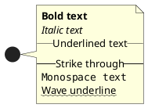
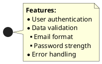
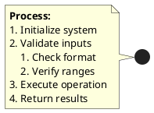
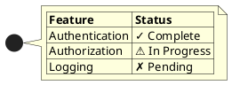
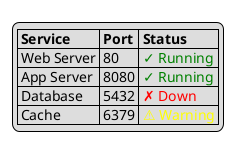
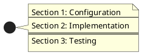

# PlantUML Creole Cheat Sheet

Complete reference for Creole text formatting in PlantUML notes, labels, and descriptions.

## Overview

Creole is a lightweight markup language supported by PlantUML for rich text formatting. It's used in:
- Notes (`note left`, `note right`, etc.)
- Class/component descriptions
- Legend text
- Title and footer
- Any text content within diagrams

## Basic Text Formatting

### Font Styles

| Syntax | Result | Example |
|--------|--------|---------|
| `**text**` | **Bold** | `**Important**` |
| `//text//` | *Italic* | `//emphasis//` |
| `__text__` | Underlined | `__underline__` |
| `--text--` | ~~Strikethrough~~ | `--removed--` |
| `""text""` | `Monospace` | `""code""` |
| `~~text~~` | Wave underline | `~~wavy~~` |

**Example:**


### Combining Styles

You can combine multiple formats:
```plantuml
**//bold and italic//**
__**bold underline**__
""**bold monospace**""
```

## HTML-Style Formatting

PlantUML also supports HTML-like tags for more control.

### Basic HTML Tags

| Tag | Purpose | Example |
|-----|---------|---------|
| `<b>text</b>` | Bold | `<b>Strong</b>` |
| `<i>text</i>` | Italic | `<i>Emphasized</i>` |
| `<u>text</u>` | Underline | `<u>Important</u>` |
| `<s>text</s>` | Strikethrough | `<s>Obsolete</s>` |
| `<sup>text</sup>` | Superscript | `2<sup>nd</sup>` |
| `<sub>text</sub>` | Subscript | `H<sub>2</sub>O` |

### Color and Background

```plantuml
<color:red>Red text</color>
<color:#FF0000>Hex color</color>
<back:yellow>Yellow background</back>
<back:#FFFF00>Hex background</back>
<color:red><back:yellow>Both</back></color>
```

**Common Colors:**
- `red`, `green`, `blue`, `yellow`, `orange`, `purple`
- `black`, `white`, `gray`, `darkgray`, `lightgray`
- `pink`, `brown`, `cyan`, `magenta`
- Hex codes: `#RRGGBB`

**Example:**


```plantuml
@startuml
note left
  <color:red>Error:</color> Connection failed
  <color:green>Success:</color> Operation completed
  <back:yellow>Warning:</back> Deprecated API
  <color:white><back:red>CRITICAL</back></color>
end note
@enduml
```

### Font Size

```plantuml
<size:18>Large text</size>
<size:8>Small text</size>
<size:24>Extra large</size>
```

**Example:**


```plantuml
@startuml
note right
  <size:20>Heading</size>
  --
  <size:12>Normal text</size>
  <size:8>Fine print</size>
end note
@enduml
```

### Font Family

```plantuml
<font:Arial>Arial font</font>
<font:Courier>Courier font</font>
<font:Times>Times font</font>
```

### Combining HTML Tags

```plantuml
<color:red><b><size:16>IMPORTANT</size></b></color>
<font:Courier><color:blue>code_example()</color></font>
```

## Lists

### Unordered Lists (Bullets)

```plantuml
* First item
* Second item
** Sub-item 2.1
** Sub-item 2.2
*** Sub-sub-item 2.2.1
* Third item
```

**Example:**


### Ordered Lists (Numbered)

```plantuml
# First step
# Second step
## Sub-step 2.1
## Sub-step 2.2
### Sub-sub-step 2.2.1
# Third step
```

**Example:**


### Mixed Lists

You can combine bullet and numbered lists:
```plantuml
* Category 1
# Item 1
# Item 2
* Category 2
# Item 3
# Item 4
```

## Tables

### Basic Table Syntax

```plantuml
|= Header 1 |= Header 2 |
| Cell 1 | Cell 2 |
| Cell 3 | Cell 4 |
```

**Example:**


### Table with Formatting

```plantuml
|= Column 1 |= Column 2 |= Column 3 |
| Normal | <b>Bold</b> | <color:red>Colored</color> |
| Text | ""Code"" | <back:yellow>Highlight</back> |
```

### Colored Tables

```plantuml
|= <back:lightblue>Header 1</back> |= <back:lightblue>Header 2</back> |
| <back:lightgreen>Pass</back> | Test 1 |
| <back:pink>Fail</back> | Test 2 |
```

**Example:**


## Horizontal Lines

### Separators

```plantuml
Text above
----
Text below (thin line)
====
Text below (thick line)
```

**Example:**


## Code Blocks

### Inline Code

Use double quotes for inline code:
```plantuml
Call the ""getUserById()"" method
The config is in ""app.config.json""
```

### Code Blocks

```plantuml
<code>
function example() {
  console.log("Hello");
  return true;
}
</code>
```

**Example:**
```plantuml
@startuml
note left
  **Usage Example:**
  <code>
  const user = {
    name: "John",
    email: "john@example.com"
  };
  </code>
end note
@enduml
```

## Unicode and Special Characters

PlantUML supports Unicode characters directly:

### Common Symbols

| Category | Symbols | Usage |
|----------|---------|-------|
| Check marks | ✓ ✔ ✗ ✘ | Status indicators |
| Arrows | → ← ↑ ↓ ⇒ ⇐ ⇑ ⇓ | Directions |
| Stars | ★ ☆ ✭ ✩ | Ratings |
| Shapes | ■ □ ● ○ ▲ △ | Bullets |
| Math | ∀ ∃ ∈ ∉ ∑ ∏ √ ∞ | Formulas |
| Misc | ⚠ ⓘ © ® ™ | Warnings/Info |

**Example:**
```plantuml
@startuml
note right
  **Status Indicators:**
  * ✓ Completed
  * ⚠ Warning
  * ✗ Failed
  * ⓘ Information
  
  **Priority:**
  * ★★★ High
  * ★★☆ Medium
  * ★☆☆ Low
end note
@enduml
```

### Card Suits and Symbols

```plantuml
♠ Spades
♣ Clubs
♥ Hearts
♦ Diamonds
♪ Music note
☺ Smiley
☹ Frowny
```

## Links

### External Links

```plantuml
[[https://example.com Link Text]]
[[https://example.com]]
See [[https://docs.example.com documentation]]
```

**Example:**
```plantuml
@startuml
note right
  References:
  * [[https://plantuml.com Official Documentation]]
  * [[https://github.com/plantuml GitHub Repository]]
  * [[https://real-world-plantuml.com Examples]]
end note
@enduml
```

### Local File Links

```plantuml
[[file:///path/to/file.pdf Documentation]]
[[./relative/path/file.md Readme]]
```

## Images

### Embedding Images

```plantuml


```

You can also use standard library sprites:
```plantuml
!include <font-awesome-5/users>
<$users>
```

## Practical Examples

### Error Message

```plantuml
@startuml
note right
  <color:red><b>ERROR</b></color>
  ----
  **Message:** Connection timeout
  **Code:** E_TIMEOUT_001
  **Action:** Retry operation
  
  <back:yellow>⚠ Check network connectivity</back>
end note
@enduml
```

### API Documentation

```plantuml
@startuml
note left
  **API Endpoint**
  ----
  <b>POST</b> <color:blue>/api/v1/users</color>
  
  **Request:**
  <code>
  {
    "name": "string",
    "email": "string"
  }
  </code>
  
  **Response:**
  <code>
  {
    "id": "uuid",
    "status": "created"
  }
  </code>
  
  **Status Codes:**
  * <color:green>201</color> - Created
  * <color:red>400</color> - Bad Request
  * <color:red>409</color> - Conflict
end note
@enduml
```

### Feature Matrix

```plantuml
@startuml
legend right
  |= **Feature** |= **Free** |= **Pro** |= **Enterprise** |
  | API Access | ✓ | ✓ | ✓ |
  | Rate Limit | 100/hr | 1000/hr | Unlimited |
  | Support | Community | Email | 24/7 Phone |
  | SLA | ✗ | <color:green>99%</color> | <color:green>99.9%</color> |
  | Custom Domain | ✗ | ✓ | ✓ |
  | SSO | ✗ | ✗ | ✓ |
endlegend
@enduml
```

### Task Checklist

```plantuml
@startuml
note as TaskList
  <size:16><b>Sprint Tasks</b></size>
  ====
  **Completed:**
  * ✓ User authentication
  * ✓ Database migration
  * ✓ API endpoints
  
  **In Progress:**
  * ⚠ Frontend integration (80%)
  * ⚠ Unit tests (60%)
  
  **Pending:**
  * ○ Documentation
  * ○ Deployment
  * ○ Performance testing
end note
@enduml
```

### System Requirements

```plantuml
@startuml
note right
  <size:18><b>System Requirements</b></size>
  ----
  **Minimum:**
  * CPU: 2 cores
  * RAM: 4 GB
  * Disk: 20 GB SSD
  * OS: Ubuntu 20.04+
  
  **Recommended:**
  * CPU: 4 cores
  * RAM: 8 GB
  * Disk: 50 GB SSD
  * OS: Ubuntu 22.04 LTS
  
  <back:yellow>⚠ Note: Windows support experimental</back>
end note
@enduml
```

## Tips and Best Practices

1. **Use semantic colors**: Red for errors, green for success, yellow for warnings
2. **Combine formats sparingly**: Too much formatting reduces readability
3. **Prefer HTML tags for precise control**: Especially for colors and sizes
4. **Use tables for structured data**: Easier to read than lists
5. **Add Unicode symbols for visual cues**: ✓, ✗, ⚠, ⓘ improve scannability
6. **Keep code blocks concise**: Long code should be in separate files
7. **Use horizontal lines to separate sections**: Improves note organization
8. **Test in PlantUML preview**: Rendering can vary by output format

## Common Gotchas

| Issue | Cause | Solution |
|-------|-------|----------|
| Formatting not working | Wrong syntax | Check spacing around markers |
| Colors not showing | Text output | Use SVG or PNG output |
| Table misaligned | Missing `\|` | Ensure all cells have delimiters |
| Links not clickable | PDF output | Use SVG for interactive links |
| Unicode not showing | Missing font | Use standard ASCII alternatives |

## References

- **Official Creole Guide**: https://plantuml.com/creole
- **PlantUML Site**: https://plantuml.com/
- **Creole Wiki**: http://www.wikicreole.org/

---

**Last Updated**: February 2026  
**Version**: 1.0
